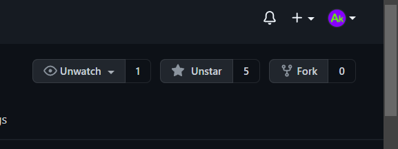
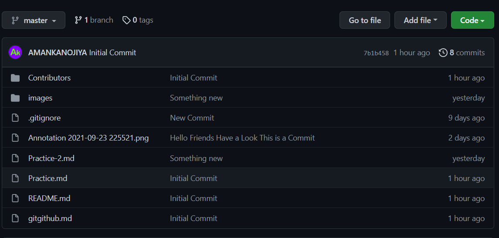
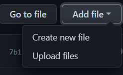
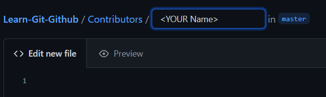
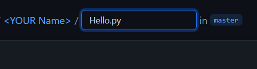
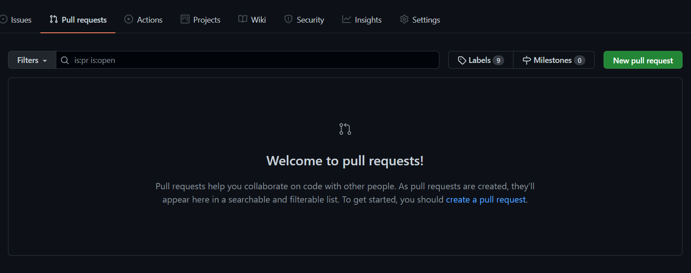

### **comming soon ..... (stay Tuned 😊)**

**_A repository for contributing a "HELLO WORLD" program in any of the programming languages you know Or can Create a File With some Info about You_**

## **Comfortable With CMD ??**

No issue [Click HERE](Practice-2.md)

## **Not Comfortable With CMD ??**

_This is all Yours_

## How to Contribute: 👨🏻‍💻

1. Star the Project.
2. Fork the project.<br>
   </img>
3. Make any changes in your forked repo (This will Create a new Remote repo in your Dashboard)
4. Make Some changes
5. On this repo, click `Pull Requests` and raise a `Pull Request` selecting your fork on the right drop down

Questions can be asked by raising an `Issue`.

## What is forking?

When we love someone’s repository and would like to have it in our GitHub account, we fork it so that we can work with it separately.

When we fork a repository, we get an instance of that entire repository with its whole history. After forking, we can do whatever we want to do without affecting the original version.

## How to add file on your fork repo: ✂📋

- This repo will look similar to Original one<br>

  </img>

- Open the Contributors Folder (add New File)<br>

  </img>

- Create New folder Name it `<Your Name>/` (don't forgot to put a `/` this will Create a Folder)<br>

  </img>

- Open the <Your Name> Folder

- Create a Program File name it Hello.py or Your Choice You can try to add Multiple File<br>

  </img>

  </img>

  ```bash
  print("Hello World !")
  print("I am <YourName>")
  print("I am From <Place>")
  print("I am <Your College Name and Year of Study>")
  print("Email ID : <Your Email>")
  print("Github : <Your Github>")

  ```

- Commit the Change scroll Down and add or Commit this file

- Pulling your request. Click on the Pull requests tab on the forked github repository.

  - **_Note : A pull request allows your changes to be merged with the original project._**<br>

    </img>

```
  Click on New Pull Request
```

- Add PR name and Detail What are the Changes
  now Click On Create PR

- Wait for your changes to be merged
  - You may Also Get Comments 😉 This will Help you To understand the Workflow
- Voila! You successfully made a contribution. 😉
