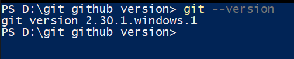

#### FOR HACKTOBER FEST CLICK [HERE]("hacktober.md")

# Git and Github

## Installation and Getting Started

- Google search " Git Download "
- Download Git and Follow the simple Installation Steps
- got to Cmd line or Power shell
- Try This command :-

  ```bash
  git --version
  ```

  </img>
  _Congratulations, you have verified your Git version._

### Explore Help

```bash
git -h
```

### Configure your user name, email address and default Git editor

1. Configure your user name, email address and default Git editor

```bash
git config user.name
```

2.  If you would like to change your user name, use

```bash
git config --global user.name "Your Name"
```

3.  View your current setting for your email address with

```bash
git config user.email
```

4.  If you would like to change your email address, use

```bash
git config --global user.email "your@email"
```

5.  View your current setting for default Git editor with

```bash
git config core.editor
```

_Congratulations, you have configured your user name, email address and default editor_

## Create a Local Repository

### Create a repos directory for all your local repositories

```bash
mkdir Project
cd Project
```

### initialize a repository.

```bash
git init

//OUTPUT//
Initialized empty Git repository in Project/.git/
```

_Congratulations. You have created a local repository_

## Commit to a Local Repository

### View file status using

```bash
git status
```

- This command It used to see the file and dir status

- In a command line, navigate to your "Project" directory and execute git status . You
  should see the message "Nothing to commit"

- Execute `git status` . You should see that Git notices the fileA.txt file and identifies it
  as untracked.

### Stage content

```bash
git add  " <file name> // or // < . > "
```

file name -> FileName File on Working Tree <br>
< . > -> all File on Working Tree

### Commit content

- Git manages versions of projects
- Each Version of a project is called a commit
  (eg)
- Each commit is a sanpshot the entire project

  ```bash
  git commit -m "<commit Statement>"
  ```

  -m is used to add a Commit statement or message

### View the commit history using git log

- You should see your commit details, including your commit message

  ```bash
  git log
  ```

  - Execute `git log --oneline` . A concise version of the history is displayed

_Congratulations. You have staged a file and created a commit_
