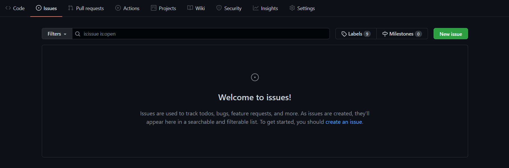
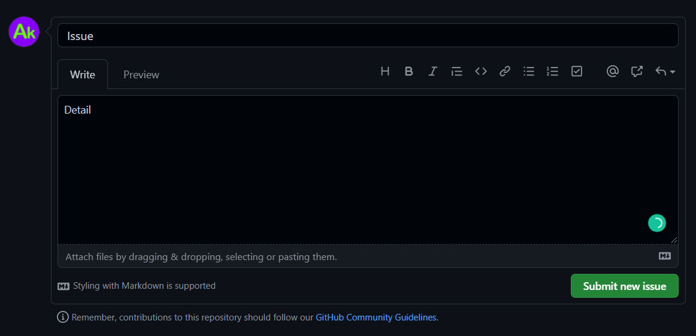

# [**Hacktober Fest 2021**](https://hacktoberfest.digitalocean.com/)

<br>
<br>

<br>
<br>

[Please watch this YouTube video first](https://www.youtube.com/watch?v=JZeHxbLm_IQ)

**Hola Friends ( _Hello dosto_ )! <br>
I am **Aman Kanojiya** , <br>
Let's get some Awesome Information about this Amazing event and Contribute to open source to ..<br>**

**_" make World a better place to Live"_**

## What is Hacktober Fest?

Hacktoberfest 2021 is a month-long virtual festive event which aims to celebrate open source contributions presented by Digital Ocean, Intel and DEV. It is the easiest way to get started with open source!

## How to participate?

You just need to make five contributions to open source projects before October 31. This is an Amazing Opportunity to getting started with Open Source and Make your Move, and Yes will receive a free Hacktoberfest t-shirt and some Swags, Isn't it Awesome.

## How can a beginner participate?

For beginners, they are saying that you could make contributions to documentation for some projects. But this also needs some level of effort. When I heard about Hacktoberfest, I just registered and left it there without making any contributions. But then I go through the list of projects and find some too easy projects to contribute to. So I'm listing here four Github repositories anyone can contribute to. It's too easy. You just need to add your Github profile name etc., in their readme file. Some of them have instructions on how to contribute. So let's do it.

- Step 1: Register or login to github.com <br>
  (_Those Who have already Registered in can move to the next step_)
- Step 2: Register to Hacktoberfest.<br>
  (_Those Who have already Registered in can move to the next step_)
  https://hacktoberfest.digitalocean.com/
- Step 3: Contribute to Any Four repositories or any others repositories you like. Check instructions to contribute in each repository. It's hard. It's always hard for the first time you do something. Especially when you are collaborating, making mistakes …
    *_You can Get all The Topics [Here](https://github.com/topics/hacktoberfest)_*

- Step 4: Check your progress from [Hacktoberfest](https://hacktoberfest.digitalocean.com/) Website after Logging In.

- Step 5: Few days after the end of the program (31 Oct), you will receive an e-mail from Digital Ocean asking for shipping details. 

- Step 6: Wait for that awesome Hacktoberfest t-shirt from Github & Digital Ocean.

## Want To Practice ??

### [Start Practice 👈](http://example.com/)

## Any Query ??

- Raise an Issue
  ### How to Raise an Issue ??
  - On top There is a section of `Issue` add new Query<br>
    </img><br>
  - Type your Query and Explain it a bit<br>
    </img><br>
  - Click on add Issue<br>
    `You are Good to go !`
- You can Contact me on my email ID given below:
  ```bash
  aman.kanojiya4203@gmail.com
  ```
